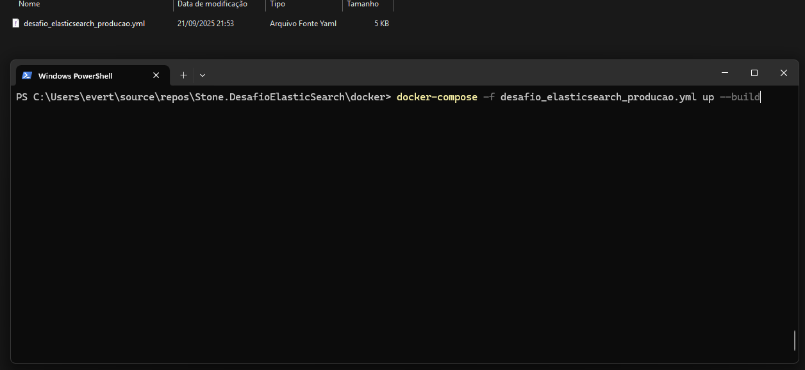

# Desafio ElasticSearch Stone

## Tier 0

### Diagrama Arquitetura

### Definições Tiers

#### Tier 1: Gerador de Massa de Dados - Console App (Kafka Producer)

Este aplicativo de console é um producer Kafka que gera e envia grandes volumes de dados de transações para um cluster Kafka. Ele é ideal para testes de performance, escalabilidade e cenários de estresse, simulando diferentes níveis de carga no sistema.

##### Como Funciona

Ao executar o aplicativo, você verá um menu interativo que permite escolher entre diferentes cenários de geração de dados. Cada cenário envia um número específico de mensagens por transação, simulando diferentes níveis de carga no sistema.

Descrição dos Cenários

##### Menu Principal

##### Descrição dos Cenários

| Opção | Cenário       | Batch Size | Máx. Batches/Envio | Delay (ms) | Total de Mensagens |
|-------|---------------|-----------|------------------|------------|------------------|
| 1     | Alta Carga    | 4.000     | 100              | 500        | 400.000          |
| 2     | Média Carga   | 1.000     | 50               | 250        | 50.000           |
| 3     | Baixa Carga   | 100       | 10               | 200        | 1.000            |

###### Explicação dos parâmetros

- **Batch Size:** Quantidade de mensagens geradas por lote.
- **Máx. Batches/Envio:** Quantos lotes são enviados em sequência antes de aguardar o delay.
- **Delay (ms):** Pausa entre envios de lotes, em milissegundos.

##### Detalhes Producer
- O producer Kafka é configurado com EnableIdempotence = true e Acks = All para garantir envio confiável.
- Cada batch é enviado em paralelo usando Parallel.ForEachAsync.
- As transações Kafka são iniciadas com BeginTransaction() e confirmadas com CommitTransaction().
- Em caso de erro, a transação é abortada com AbortTransaction() e registrada no log.
- Cada mensagem possui headers com informações de aplicação e correlationId.

### Tier 2: Consumer de Transações - Console App (Kafka Consumer)

Este aplicativo de console é um consumer Kafka que consome mensagens de transações geradas pelo Producer, processa os dados em paralelo e persiste no Elasticsearch. Ele é ideal para cenários de ingestão em larga escala e processamento confiável de mensagens.

##### Como Funciona

O app se conecta a um tópico Kafka, consome batches de mensagens e processa cada batch em paralelo usando **Channels** e **Tasks**. Ele garante:

- **Processamento em paralelo** com número configurável de canais (`NumberChannels`)
- **Retry de operações críticas** usando Polly para Kafka e Elasticsearch
- **Persistência confiável** no Elasticsearch
- **Commit controlado** das mensagens Kafka
- **Dead Letter Queue (DLQ)** para mensagens que falham

##### Escalabilidade Horizontal do Consumer

O Consumer Kafka foi projetado para rodar múltiplas instâncias em paralelo, aproveitando o agrupamento de consumidores (GroupId) do Kafka. Isso significa que várias instâncias podem processar mensagens do mesmo tópico, dividindo as partições entre si.

No caso:

- Cada consumidor é registrado como um **HostedService** e pertence ao mesmo **GroupId Kafka**.
-  O Kafka realiza load balancing automático:
      - Cada partição do tópico é atribuída a apenas um consumidor dentro do grupo.
      - Se houver mais consumidores que partições, alguns consumidores ficarão ociosos.
      - Se houver menos consumidores que partições, alguns consumidores processarão múltiplas partições.
 
Poder analisar melhor através do [diagrama da arquitetura](#diagrama-arquitetura).

   
##### Detalhes Consumer

1. **Inicialização do Consumer**
   - O app cria um Consumer Kafka com configurações de **Idempotência** e **Read Committed**.
   - O Consumer se inscreve no tópico configurado (`TransactionConsumer`).

2. **Leitura de mensagens do Kafka**
   - As mensagens chegam em **batches JSON** contendo listas de `Transaction`.
   - Cada batch é escrito em um **Channel** para processamento paralelo.

3. **Processamento paralelo dos batches**
   - Cada canal é processado por uma **Task separada** (`ProcessAndPersistBatchesToElasticAsync`).
   - Cada batch é persistido no **Elasticsearch** em bulk (`bulkSize = 5000`).
   - Se o Elasticsearch falhar, **Polly faz retry automático**.

4. **Commit das mensagens Kafka**
   - Somente após sucesso no Elasticsearch o Consumer **confirma o offset**.
   - Se o processamento falhar de forma crítica, as mensagens vão para a **Dead Letter Queue (DLQ)**.

5. **Notificação de erros críticos**
   - Erros graves são registrados no log e podem disparar alertas (Teams, Slack, SNS, etc.) via método `NotifyTeam`.

6. **Encerramento do Consumer**
   - Quando o app é interrompido, o Channel é fechado e todas as Tasks aguardam finalizar.
   - O Consumer fecha a conexão com Kafka de forma segura.
  
## Configurações Importantes

| Configuração                       | Descrição                                                                                 |
|-----------------------------------|-------------------------------------------------------------------------------------------|
| `NumberChannels`                   | Número de canais paralelos para processamento dos batches. Ajustável conforme recursos do host. |
| `ClientId / GroupId`               | Identificação do consumidor no cluster Kafka.                                             |
| `EnableAutoCommit / EnableAutoOffsetStore` | O offset é controlado manualmente após persistência no Elasticsearch.               |
| `IsolationLevel`                   | Garante leitura apenas de transações commitadas.                                         |

### Tier 3: API de Leitura (Transaction API)

##### Visão Geral
A API é responsável por fornecer acesso às transações persistidas no Elasticsearch.
Ela utiliza o índice de leitura (transactions-read) para consultas e agregações, garantindo que a leitura não impacte a escrita.

##### Política de Retenção (ILM)

A API consulta dados em índices gerenciados por uma política ILM (transactions_index_policy), que segue as recomendações:
- 85% das consultas são atendidas nos últimos 7 dias (fase Hot).
- 99% das consultas são atendidas nos últimos 30 dias (fases Hot + Warm + Cold).
- Os dados são mantidos por 12 meses, atendendo ao requisito de retenção.

##### Endpoints Disponíveis

| Método | Endpoint                       | Descrição                                                                 |
|--------|--------------------------------|---------------------------------------------------------------------------|
| GET    | `/transactions`                | Retorna transações paginadas por **clientId** e intervalo de datas         |
| GET    | `/transactions/GetDailyTotals` | Retorna totais diários das transações, agrupados por tipo de transação     |

## Estratégia de Indexação e Persistência no ElasticSerach

A política ILM `transactions_index_policy` organiza os dados conforme a frequência de acesso e a retenção:

| Cenário | Percentual de Consultas | Fase ILM | Estratégia |
|---------|------------------------|----------|------------|
| **C1 – Mais acessados** | 85% | Hot (0 a 7 dias) | Índices ativos para escrita e leitura. Rollover diário ou ao atingir 50GB. |
| **C2 – Menos acessados** | 99% até 30 dias | Warm (7 a 30 dias) | Redução de shards, forcemerge para compactar em 1 segmento. Alocados em nós warm. |
| **C3 – Raramente acessados** | Consultas acima de 30 dias | Cold (>30 dias) | Índices congelados (`freeze`). Alocados em nós cold para reduzir custo. |
| **C4 – Dados expirados** | Retenção >12 meses | Delete (>12 meses) | Índices excluídos automaticamente. |

### Índices Elasticsearch
- **transactions-write**: índice de **escrita**, usado pelo Consumer para inserir novos dados.  
- **transactions-read**: índice de **leitura**, usado pela API para consultas e agregações.

Observações:
- Percentuais de consultas ajudam a decidir em qual fase os dados permanecem.  
- A política garante **otimização de escrita/leitura**, **economia de recursos** e **retenção de 12 meses**.
- Os índices `transactions-write` e `transactions-read` seguem a política ILM **transactions_index_policy**, aplicando automaticamente as fases Hot, Warm, Cold e Delete.

## Infraestrutura

### Kafka Cluster
- **Número de nós:** 2  
- **Objetivo:** Garantir alta disponibilidade e load balancing entre produtores e consumidores.  
- **Configuração resumida:**  
  - Cluster com múltiplos brokers.  
  - Cada tópico pode ter múltiplas partições para paralelismo.  
  - Grupo de consumidores garante divisão de partições e processamento paralelo.  

### Elasticsearch Cluster
- **Número de nós:** 2 (`elasticsearch-node-1` e `elasticsearch-node-2`)  
- **Objetivo:** Alta disponibilidade, replicação e tolerância a falhas.  
- **Configuração resumida:**  
  - Cluster name: `elasticsearch-cluster`  
  - Nó 1 expõe porta 9200, Nó 2 expõe porta 9201.  
  - Política ILM aplicada (`transactions_index_policy`) com fases **Hot → Warm → Cold → Delete**.  
  - Indexação, shardeamento e replicação configurados para suportar consultas frequentes e retenção de 12 meses.  

**Observação:**  
- O Kafka e Elasticsearch estão configurados para suportar múltiplas instâncias do Consumer e do Producer, permitindo **escala horizontal** do processamento e das consultas.

##  Instruções de build e execução

### 1) Acesse a pasta "docker" que está na raiz do projeto.

### 2) Abrir o terminal no respectivo local e exectuar o arquivo "arquivo-propostaseguro_producao" com o seguinte comando: 
**"docker-compose -f propostaseguro_producao.yml up --build"**

### 3) Após executar o comando
A execução do projeto pode demorar um pouco (em torno de **6 minutos**), pois o Docker precisa baixar as imagens, construir o projeto e subir os containers. Durante esse processo, os serviços internos precisam ser inicializados e a configuração do Kafka e do ElasticSearch será aplicada. Quando tudo estiver concluído, o projeto estará disponível para testes.

### 4) Enviar a massa de dados para o Kafka

Siga os passos abaixo:

1. Abra o terminal e execute os seguintes comandos:
   - docker exec -it transactions-producer /bin/bash
   - dotnet Stone.Transactions.Producer.dll
       
    

   Será aberto um **console interativo**, onde você poderá escolher a opção de envio dos dados. Após selecionar a opção desejada, a massa de dados será enviada automaticamente para o **Kafka**.

   

### 5) Acompanhar a execução dos Consumers

#### (Opção 1) Via **Docker Desktop**

Abra o Docker Desktop Escolha um dos três containers disponíveis:
   - `transactions-consumer1`
   - `transactions-consumer2`
   - `transactions-consumer3`
     
   Em seguida, clique para abri-lo:

   

   Nos logs do container, você poderá visualizar a quantidade de mensagens **consumidas** e **salvas no ElasticSearch**:

   

#### (Opção 2) Via **Docker Desktop**

Abra **três janelas do Prompt de Comando** e execute os seguintes comandos;
- docker logs -f --timestamps transactions-consumer1
- docker logs -f --timestamps transactions-consumer2
- docker logs -f --timestamps transactions-consumer3

  

  Você também conseguirá visualizar os logs em tempo real.
  
  
  
  

   

 
   
